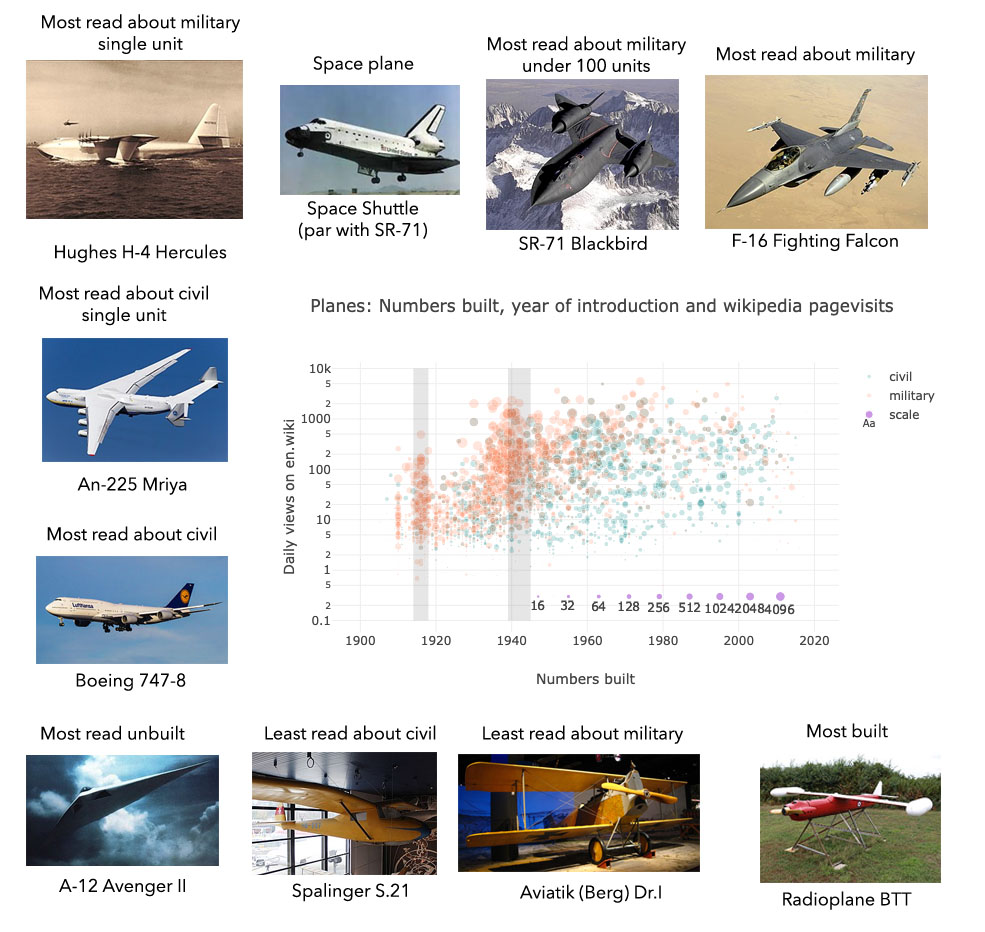

# Wikipedia_planes
Datamining wikipedia for planes

Python 3.7 Jupiter notebook — contains f-strings. [Link to static HTML export of Jupyter notebook](http://users.ox.ac.uk/~bioc1451/planewiki_notebook.html) will several plots and lists of interesting planes &mdash;zero/one unit high visit planes are weird (Spruce goose, A-12 etc.) and worth a gander.

